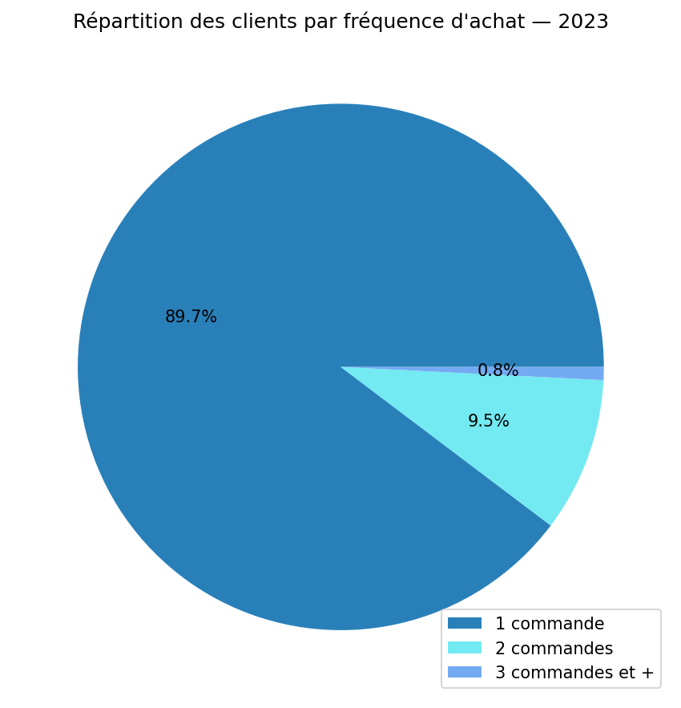
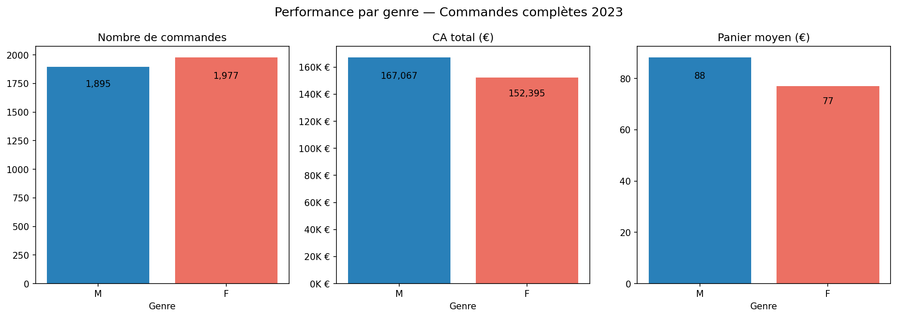
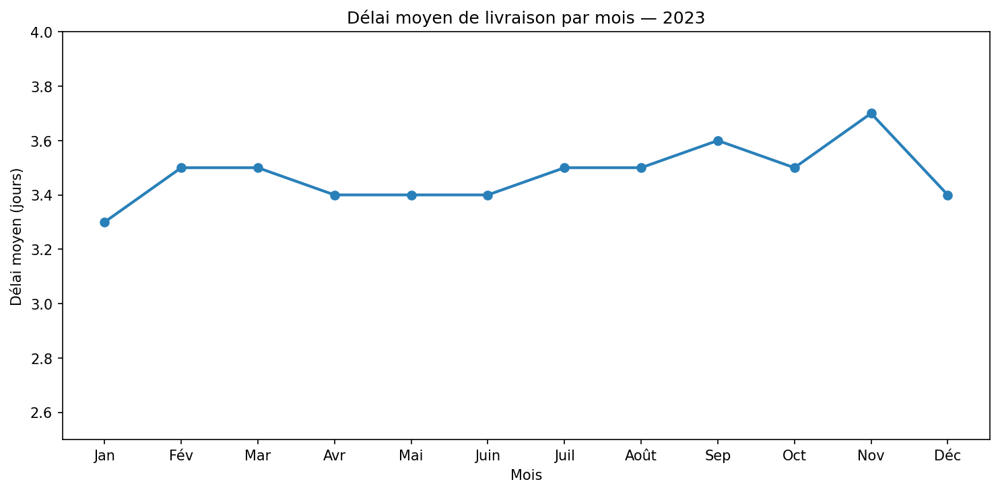

# analyse-client-thelook-2023
Analyse clients e-commerce avec SQL (BigQuery) et Python — dataset TheLook 2023

## Contexte
Analyse clients d'un e-commerçant fictif (dataset public Google) sur l'année 2023.
Objectif : comprendre le comportement des clients pour répondre au faible taux de conversions et mettre en place des recommandations adaptées.

## Stack technique
- SQL (BigQuery)
- Python (Pandas, Matplotlib)

## Insights clés
1. Un retour des clients quasi inexistant : 90% des clients font une seule commande sur l'année, 9.5% deux commandes et moins de 1% des clients font trois commandes ou plus.
2. Une répartition du CA contradictoire aux marché du textile avec un CA quasi-iso entre les hommes (52%) et les femmes (48%).
3. Un délai moyen de livraison est de 3,5 jours, cohérent avec les standards du marché e-commerce qui ne répond pas au problème de rétention client.

## Recommandations
1. Vérification de la qualité des données pour évaluer la véracité des  chiffres sur la fréquence client + campagne de retargeting pour fidéliser les clients.
2. Campagnes de marketing pour cibler les femmes si l'analyse du stock met en avant une forte part de produits destinés à cette cible.
3. Lancement d'un audit du process logistique entre expédition et livraison, qui représente la chute la plus critique du funnel (-47%) + mise en place d'un questionnaire de satisfaction post-livraison.
   
## Méthodologie
1. Analyse de la fréquence - utilisation de la table "orders"
Vérification de la bonne remontée des datas avec 1 order_id par commande et aucun user id absent.
Somme des achats par user_id et création d'une colonne avec la fréquence des users (CASE WHEN).
2. Panier moyen par type de client - utilisation des tables "orders" (pour avoir le genre du client) et de la table "order_items" pour le calcul des KPI.
LEFT JOIN sur la table order items et GROUP BY gender.
3. Délais de livraison moyens par mois - utilisation de la table "orders"
Vérification que chaque commande "complete" a bien une date de livraison + calcul du délai de livraison par commande avec DATE_DIFF(delivered_at,created_at,DAY).
Calcul du délai moyen mensuel  avec ROUND(AVG(delai_jours), 1) et un GROUP BY MONTH
  
## Visualisation

